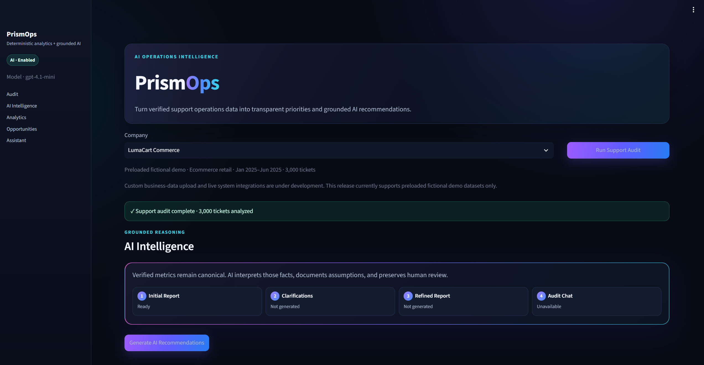
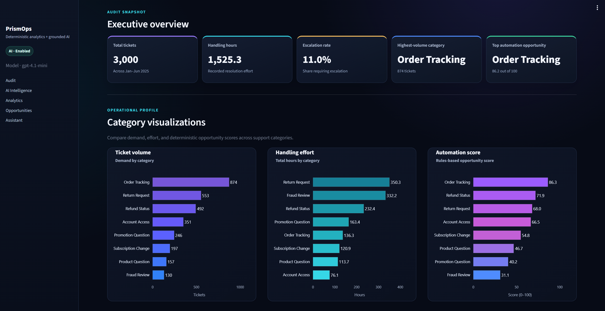
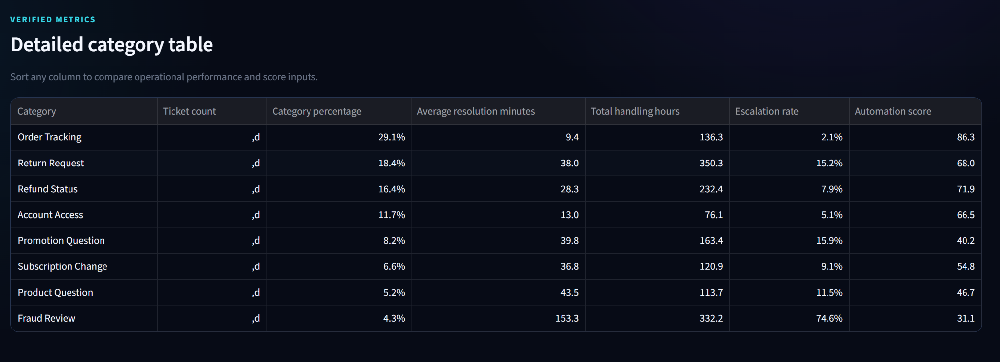
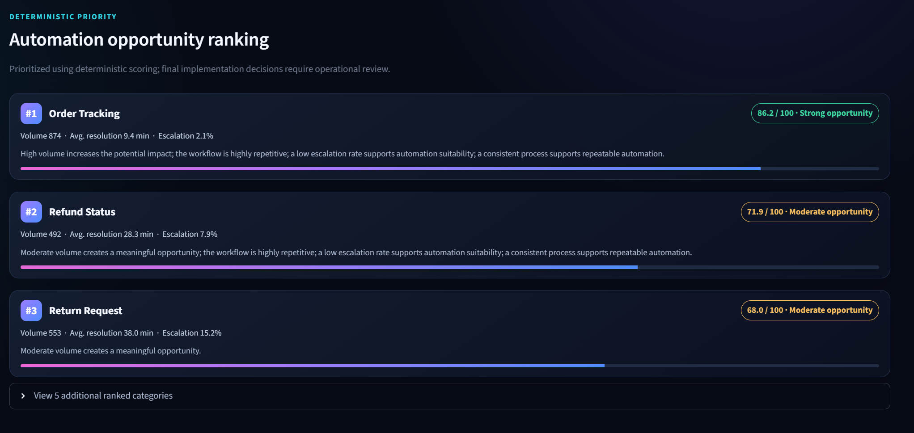
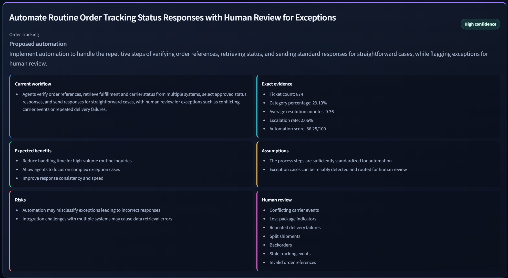
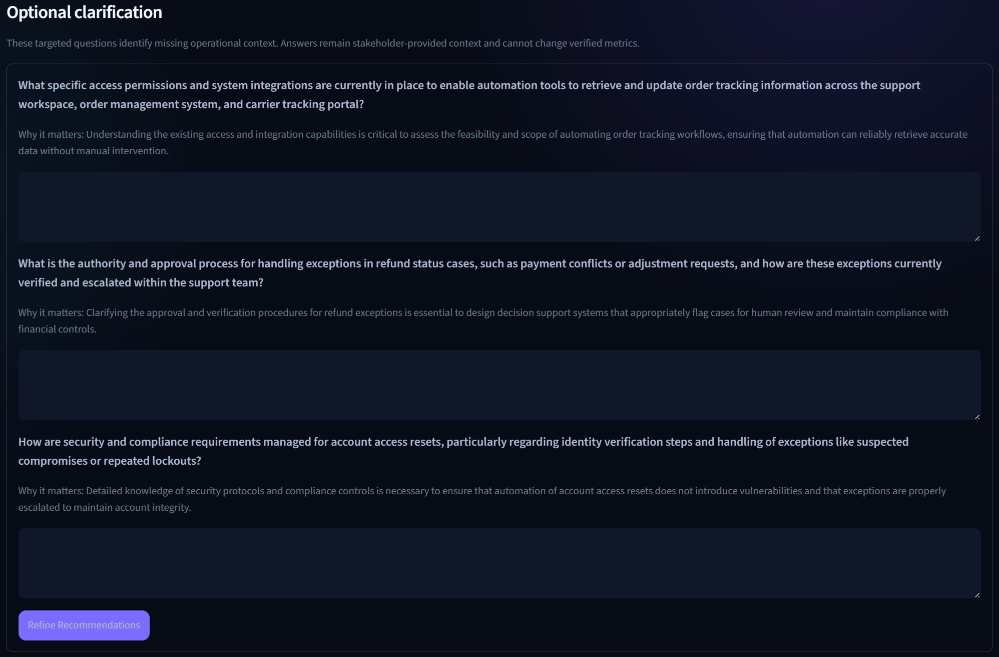
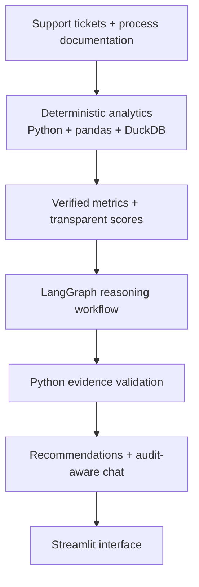

# PrismOps

PrismOps is an AI operations intelligence platform for customer-support audits. It turns synthetic support data and documented workflows into reproducible operational metrics, transparent automation scores, and optional evidence-backed AI recommendations.

> **Python calculates facts. The LLM interprets those facts.**

The repository includes three fictional companies with 3,000 tickets each. PrismOps applies the same deterministic analytics and LangGraph workflow to every company, demonstrating a reusable architecture rather than a single hardcoded demo.

## What Works Without an API Key

The complete deterministic support audit runs locally without an OpenAI API key:

- Support-ticket metrics
- Handling-time and escalation analysis
- Category comparisons
- Transparent automation opportunity scoring
- Interactive Plotly charts
- Sortable category tables
- Process documentation
- Exact scoring methodology

Optional AI features use a **bring-your-own-key (BYOK)** model and require a developer-supplied OpenAI API key:

- Evidence-backed recommendations
- Operational clarification questions
- Refined reports
- Audit-aware chat

PrismOps does not include or host a shared API key. ChatGPT Plus does not automatically include OpenAI API usage, which may be billed separately.

> **Custom business-data upload and live system integrations are under development. This release currently supports preloaded fictional demo datasets only.**

## Product Walkthrough

### Step 1: Select a Company and Run the Audit



Choose from three fictional companies, each with exactly 3,000 tickets. Running the audit uses deterministic Python analytics and requires no API key.

### Step 2: Review the Executive Audit Snapshot



Review ticket volume, handling hours, escalation rate, leading categories, and dark-theme category charts at a glance.

### Step 3: Inspect Detailed Metrics



The sortable table exposes verified category-level counts, percentages, resolution times, handling hours, escalation rates, and automation scores.

### Step 4: Compare Automation Opportunities



Rankings use documented rules and verified metrics. They are transparent, preliminary decision support—not automatic implementation decisions.

### Step 5: Generate Grounded AI Recommendations



With BYOK enabled, PrismOps produces up to three recommendations containing:

- Exact deterministic evidence
- Assumptions
- Expected benefits
- Risks
- Human-review requirements
- Confidence

Raw ticket rows are never sent to the LLM.

### Step 6: Add Stakeholder Clarification



Optional answers add clearly labeled stakeholder context. They can refine recommendations but cannot overwrite verified metrics.

## Architecture



The **deterministic layer** calculates counts, averages, percentages, handling hours, escalation rates, rankings, and automation scores. The **generative layer** interprets that evidence, explains priorities, identifies risks, asks focused clarification questions, and supports audit-aware follow-up questions.

This separation reduces hallucination risk, prevents the model from becoming the numerical source of truth, and makes the system easier to test.

Core technologies: **Python, pandas, DuckDB, Streamlit, Plotly, LangChain, LangGraph, OpenAI, Pydantic, and pytest**.

### LangGraph and Validation

```text
prepare_evidence
      ↓
analyze_processes
      ↓
generate_recommendations
      ↓
verify_recommendations
      ↓
build_executive_report
      ↓
generate_clarification_questions
```

Typed Pydantic outputs and Python validation reject unsupported categories, invented numeric claims, duplicate recommendations, and unsupported guarantees before results reach the interface. Refinement reuses the original audit rather than recalculating or replacing canonical evidence.

## Demo Companies

| Company | Industry | Top opportunity | Low-suitability area |
|---|---|---|---|
| Northstar Industrial Supply | Industrial distribution | Order Status | Miscellaneous |
| HarborPoint Health Services | Healthcare administration | Appointment Scheduling | General Inquiry |
| LumaCart Commerce | Ecommerce | Order Tracking | Fraud Review |

Each dataset contains exactly 3,000 fixed-seed fictional tickets with distinct category, handling-time, escalation, channel, and customer-tier patterns. All three use the same analytics and LangGraph pipeline.

Switching companies clears prior audit and AI state. Metrics, process evidence, clarifications, recommendations, and chat context are never reused across companies.

HarborPoint is entirely fictional. Its dataset contains no PHI, patient identities, diagnoses, or clinical decision-making.

## Quick Start

### 1. Clone the repository

```bash
git clone https://github.com/ChetHefton/PrismOps.git
cd PrismOps
```

### 2. Create and activate a virtual environment

Windows PowerShell:

```powershell
python -m venv .venv
.venv\Scripts\Activate.ps1
```

macOS/Linux:

```bash
python3 -m venv .venv
source .venv/bin/activate
```

### 3. Install dependencies

```bash
python -m pip install --upgrade pip
pip install -r requirements.txt
pip install -e . --no-deps
```

### 4. Optionally configure AI features

The deterministic audit works without this step. To enable AI features, copy the example file:

Windows PowerShell:

```powershell
Copy-Item .env.example .env
```

macOS/Linux:

```bash
cp .env.example .env
```

Then edit the root-level `.env` file:

```dotenv
OPENAI_API_KEY=your_openai_api_key_here
PRISMOPS_LLM_MODEL=gpt-4.1-mini
PRISMOPS_LLM_TEMPERATURE=0
```

Leave `OPENAI_API_KEY` empty to use deterministic features only. Keep `.env` in the project root and never commit it.

### 5. Launch PrismOps

```bash
python -m streamlit run app.py
```

Open the local URL printed by Streamlit.

## Security and Evidence Boundaries

The LLM receives only:

- Selected company metadata
- Aggregate verified metrics and automation scores
- Process documentation
- Optional, labeled stakeholder context
- A bounded number of recent conversation turns

It does **not** receive raw ticket rows, API keys, evidence from another company, permission to modify verified metrics, or access to external business systems. Local secrets are loaded server-side, and `.env` is ignored by Git.

## Testing

```bash
python -m pytest -q
```

Latest verified result: **57 tests passed**.

- All LLM calls are mocked.
- Tests require no API key and make no network requests.
- Fixed-seed dataset reproducibility is verified.
- Cross-company state and evidence isolation are tested.

## Current Limitations

- No custom data upload or live integrations
- No authentication or persistent user accounts
- No audit history or workflow execution
- No forecasting or guaranteed business outcomes
- Recommendations require human operational, security, and compliance review

## Roadmap

- CSV/XLSX upload and schema mapping
- CRM and ticket-platform integrations
- Audit history and cross-period comparisons
- Forecasting and scenario analysis
- Authentication and deployment workflows
- Report export and team collaboration
